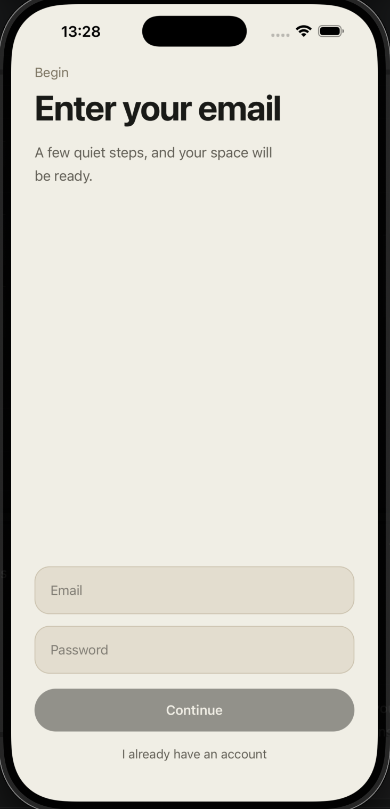
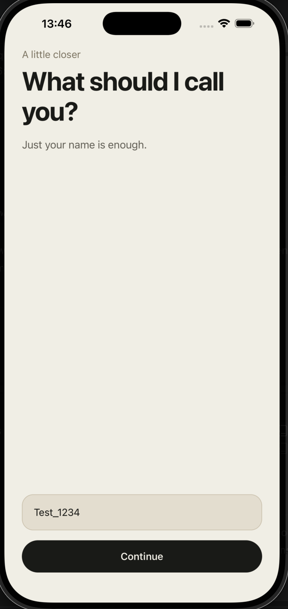
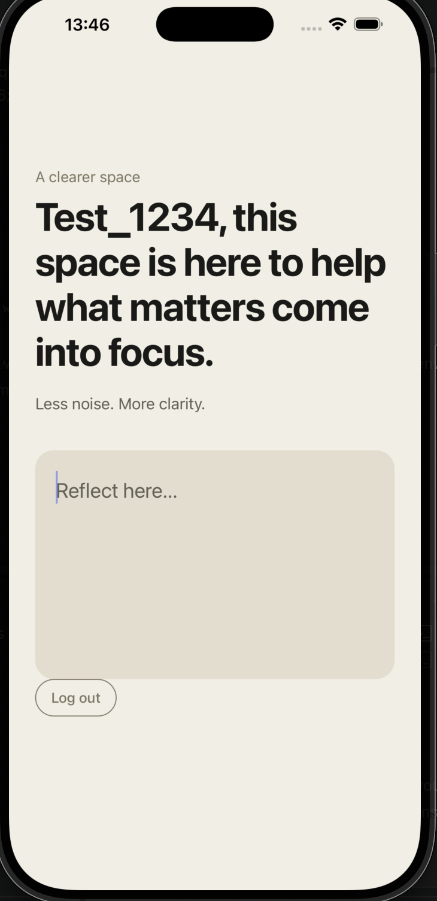

## Journal Onboarding

### Overview

This project is a mobile onboarding flow built with React Native and Expo.
It demonstrates how to design and implement a structured user onboarding experience, including navigation, state handling, and backend integration.

The application is connected to Supabase for handling user data and backend communication.

---

### Screens

| Sign up | Name | Frequency | Reflection |
|--------|------|-----------|------------|
|  |  |  |  |

---

### Features

* Multi-step onboarding flow
* Form handling and validation
* Navigation between onboarding screens
* Integration with Supabase backend
* Clean and modular component structure

---

### Tech Stack

* React Native (Expo)
* JavaScript / TypeScript
* Supabase
* REST APIs

---

### Getting Started

1. Install dependencies
   npm install

2. Set up environment variables
   Create a `.env` file in the root of the project
   Copy contents from `.env.example`

Add your credentials:
EXPO_PUBLIC_SUPABASE_URL=your_url
EXPO_PUBLIC_SUPABASE_PUBLISHABLE_KEY=your_key

3. Run the app
   npx expo start

---

### Running the App

You can open the app using:

* Expo Go (scan QR code)
* Android emulator
* iOS simulator
* Web

---

### Notes

* The app will not work without the `.env` file
* Do not commit your `.env` file

---

### Purpose

This project was created to demonstrate practical experience in building mobile applications, handling user flows, and integrating frontend applications with backend services.
